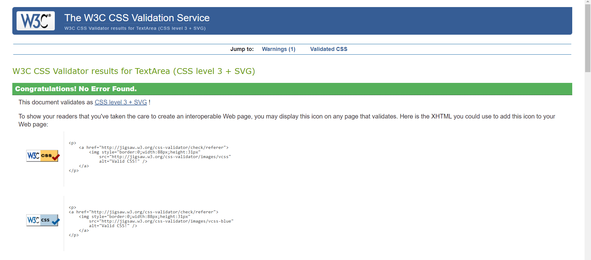

# Anime Quiz Game

📚 Test your knowledge and challenge your friends as you dive into a vast collection of carefully crafted questions spanning across genres, decades, and iconic series. Whether you're a seasoned otaku or just starting your anime adventure, this quiz game promises to entertain, educate, and engage.

You can visit the website here: [Anime Quiz Game](https://thomasthantzin.github.io/anime-quiz/)

## Authors

- [Thant Zin Oo](https://github.com/ThomasThantZin)

## Feature

The website was designed in clean and straightforward design to make the player easily to play and understand with start buttons and four mutiple choice bottoms.There will be five questions whatever you start the game and it'll shuffle random five question when you start the game or restart the game.

When you choose the correct or wrong answer, you will recieve an alert the you are correct or wrong.And when you finish answering all 5 questions you will recieve the result score and the restart button in the end.

### Fonts

For fonts Righteous and Vina Sans fonts are used

### Existing Features

 **Game Intro**
- Wrote in clear design, make player to understand how's the game works and start button to start the game.

 **When The Game Start**
- Starting the game will give player Question with image and 4 multiple choice button.

**Correct or Wrong Answers**
- When players choose correct answer button, they will get alert that they are correct or When players choose incorrect answer button, they will get alert that they are incorrect.

**Result Score and Restart**
- Finishing the game will give the players their scores and restart button.

### Feature to implement

- I really would like to add background music whatever you start the new question .
- And some cool UX designs.

## Testing

All pages were tested on Google Chrome, Safari and Firefox

### Validator Testing

- HTML

  - No errors were returned when passing through the official 
  

- CSS

  - No errors were found when passing through the official
 

- JS

  - No errors were found when passing through the [JS checker](https://jshint.com/)
  
### Performance

- **Performance checked from google light house.** 
-  Performance
  

## Deployment

- The site was deployed to GitHub pages. The steps to deploy are as follows:
  - In the GitHub repository, navigate to the Settings tab
  - From the source section drop-down menu, select the Master Branch
  - Once the master branch has been selected, the page will be automatically refreshed with a detailed ribbon display to indicate the successful deployment.

The live link can be found here: [Anime Quiz Game](https://thomasthantzin.github.io/anime-quiz/)

## Credit

### Code

- Took simple from Code Explained JS tutorial.
- Took simple from Love Math project.
- Took readme.md simple  from [Code Institute read me template](https://github.com/Code-Institute-Solutions/readme-template)

### Media

- All the images are from [Ncoll Central](https://art.ncoll-central.com/)

#### This Website is only for Educational purpose

## Acknowledgements

I would like to take the opportunity to thank:

- To God, who is with me the whole time when I writing the code for this webpage.
- The lovely and helpful people on the Code Institute Slack page for support
- My lovely friends from Myanmar, who are helping me.
- To Code Institute Community for teaching me how to write these CODES.
  